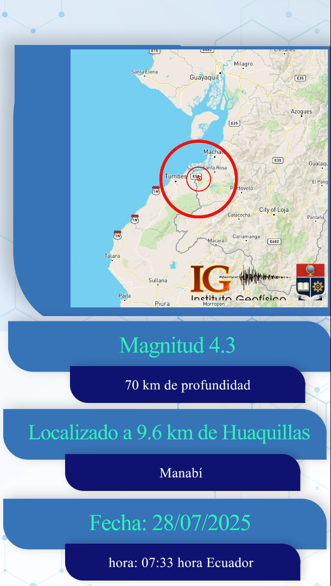

# Software Requirements Specification  
IGSISMANI – Sistema de Generación de Animaciones Sísmicas  
Versión 0.9 (borrador)

## 1. Introducción

### 1.1 Propósito  
El propósito de este documento es describir de manera clara y estructurada los requerimientos funcionales y no funcionales del sistema IGSISMANI.  
El documento servirá como referencia para desarrolladores, futuros mantenedores, analistas del área de Sismología y personal de Monitoreo que interactúe con el sistema o consuma sus resultados.

### 1.2 Alcance  
IGSISMANI es un sistema que genera automáticamente un video animado con información de un evento sísmico.  
El usuario inicia el proceso conectándose a una URL del servicio e ingresando un código de evento con sus credenciales.  
El sistema retorna un video con información validada y lo envía por correo electrónico a los usuarios designados.  
Opcionalmente, puede almacenar el video en un repositorio institucional como SharePoint.

### 1.3 Definiciones y abreviaturas  
- Evento sísmico: Registro sísmico proveniente de un servicio FDSN.  
- Usuario autorizado: Personal de Sismología o Monitoreo con usuario y contraseña válidos.  
- Repositorio institucional: Carpeta o servicio de almacenamiento interno (ejemplo: SharePoint).  
- SRS: Software Requirements Specification.

### 1.4 Referencias  
- Respuestas del cliente: “SRS.Preguntas.JSanto.pdf”.  
- Código fuente actual del proyecto IGSISMANI.  
- Documentación de módulos utilizados (Plotly, Manim, FFmpeg, bibliotecas geoespaciales).

### 1.5 Visión general del documento  
Este documento presenta primero una descripción general del sistema y luego detalla los requerimientos funcionales, no funcionales e interfaces necesarias para implementar y mantener el sistema.

## 2. Descripción general

### 2.1 Perspectiva del sistema  
El sistema funcionará como un servicio que recibe un código de evento, consulta servicios de datos sísmicos, genera una animación y devuelve el video al usuario.  

No realiza publicación automática en redes sociales y no reemplaza ninguna herramienta de monitoreo existente.  

La activación se realiza mediante una URL protegida por credenciales.

### 2.2 Funciones del sistema  
En términos generales, el sistema deberá:  
- Validar credenciales del usuario.  
- Obtener datos sísmicos a partir del código de evento.  
- Generar un video animado con parámetros del evento.  
- Aplicar efectos visuales definidos por el cliente.  
- Enviar automáticamente el video por correo a una lista fija de destinatarios.  
- Permitir que el usuario descargue el archivo directamente.  
- Guardar el video en un repositorio institucional cuando este exista.

### 2.3 Características de los usuarios  
Los usuarios directos son:  
- Personal del área de Sismología.  
- Personal de Monitoreo.

Los usuarios requieren:  
- Usuario y contraseña válidos.  
- Conocer el código del evento sísmico.

### 2.4 Limitaciones  
- El sistema depende de servicios externos para obtener parámetros sísmicos.  
- La publicación en redes sociales queda fuera del alcance.  
- El sistema no realizará validación científica del evento; solo visualización.  
- Si los servicios externos fallan, el sistema generará el video con la información disponible y el usuario decidirá su uso.

### 2.5 Suposiciones y dependencias  
- Los servicios FDSN y fuentes de datos están activos y accesibles.  
- Los usuarios conocen el código del evento.  
- La infraestructura institucional permite el envío de correos electrónicos.  
- Existe un repositorio disponible para el almacenamiento (opcional).

## 3. Requerimientos específicos

### 3.1 Requerimientos funcionales

#### RF1. Autenticación  
El sistema debe requerir usuario y contraseña para acceder a la URL de generación del video.

#### RF2. Recepción de parámetros  
El sistema debe recibir al menos:  
- Código del evento sísmico  
- Usuario  
- Contraseña

#### RF3. Obtención de datos sísmicos  
El sistema debe consultar la información del evento usando el código proporcionado.  
Debe extraer:  
- Magnitud  
- Profundidad  
- Provincia  
- Localización relativa  
- Fecha del evento  
- Hora local  
- Coordenadas del epicentro

#### RF4. Generación del video  
El sistema debe generar un video con los siguientes elementos:  
- Efecto de fundido de entrada  
- Mapa animado con zoom in hasta cantón o ciudad más cercana. 
- Epicentro con ondas concéntricas  creciendo en el tiempo
- Logo institucional en la esquina inferior derecha  
- Barra informativa con parámetros del evento   
    - Sin animación para las barras de magnitud, localización, Fecha
    - Fade in / desplazamiento para las barras de profundidad, provincia y hora  
- Cierre corporativo con logo, contactos y redes sociales

#### RF4.1 Descripción de la animación
 - N(3) columnas azul, azul claro y blanco se desplazan a la izquierda disminuyendo de ancho y   
 fusionandose. 
 - El mapa y las 3 barras informativas principales entran desde la derecha y ocupan toda la pantalla

 - Las ondas concéntricas crecen desde el epicentro. 
 
 - Al mismo tiempo el crecen horizontalmente las barras informativas secundarias. 

#### RF4.2 Descripción de la información
   -  Magnitud, profundidad, distancia: 1 decimal
   -  Fecha y hora: AAAA-mm-dd HH:MM (EC)

Ejemplo:

``` bash
    Magnitud 3.3
    44 Km. de profundidad
    5.5 Km. de Pedernales
    Manabí
    2027-07-07
    18:56 Hora EC
```

#### RF4.3 Varios

  - Duración del video estimada: 10 segundos. 


#### RF5. Devolución del video al usuario  
El sistema debe permitir descargar el video desde la misma URL que inició el proceso.

#### RF6. Envío por correo electrónico  
El sistema debe enviar automáticamente el video final a los destinatarios definidos.

#### RF7. Almacenamiento en repositorio  
El sistema debe permitir guardar el video en SharePoint u otro repositorio institucional.

#### RF8. Regeneración opcional  
El usuario podrá solicitar nuevamente el video en caso de actualización de parámetros.

## 3.2 Requerimientos no funcionales

#### RNF1. Rendimiento  
El tiempo total de generación del video debe ser menor a 1 minuto.

#### RNF2. Disponibilidad  
El servicio debe estar disponible mientras los servicios de datos estén operativos.

#### RNF3. Seguridad  
El acceso debe estar protegido mediante autenticación.

#### RNF4. Mantenibilidad  
El código debe modularizarse adecuadamente.

#### RNF5. Portabilidad  
El sistema debe ejecutarse en Linux con Python 3.11 o superior.

#### RNF6. Fiabilidad  
El sistema debe manejar errores sin bloquearse.

## 3.3 Requerimientos de interfaz

### Interfaz de entrada  
- URL con parámetros de autenticación y código de evento.

### Interfaz de salida  
- Archivo de video descargable.  
- Correo electrónico enviado.  
- Video almacenado en repositorio institucional.

## 4. Anexos

### 4.1 Ejemplo de URL  
https://servidor.igepn.edu.ec/igsismani?event_id=XXXX&user=AAA&pass=BBB

### 4.2 Ejemplo de correo enviado  
Asunto: Video del evento sísmico [ID].  
Adjunto: archivo MP4.

### ANEXOS
A continuación se incluye un prototipo del video que se genera manualmente usando Adobe   


